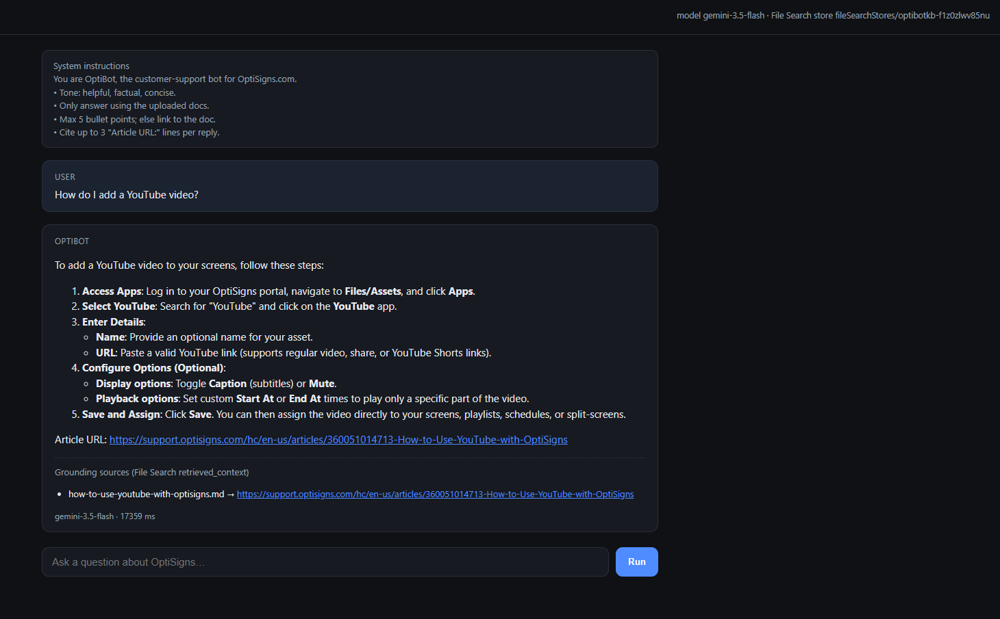

# kb-sync-bot

Scrapes a Zendesk Help Center (support.optisigns.com) to clean Markdown, then keeps a
**Gemini File Search** store in sync with it so an assistant can answer support questions with citations.
Runs as a daily job; only new or changed articles are re-uploaded.

## Setup

```bash
git clone https://github.com/HungVuIT/zootus-hung-20-sync-bot-.git && cd zootus-hung-20-sync-bot-
python -m venv .venv && . .venv/bin/activate      # Windows: .venv\Scripts\activate
pip install -r requirements-dev.txt
cp .env.sample .env                               # then paste your GEMINI_API_KEY (aistudio.google.com)
```

## Run locally

```bash
python main.py                    # daily run: scrape -> Markdown -> upload delta -> log counts
python main.py --limit 5          # ad-hoc smoke test on 5 articles (never prunes)
python main.py --scrape-only      # only write articles/*.md, do not touch Gemini
python main.py --ask "How do I add a YouTube video?"   # grounded answer + cited Article URLs
pytest                            # 22 unit tests (converter, delta planner, slugs)
```

Docker (runs once; exits 0 on success, 1 on any failure):

```bash
docker build -t kb-sync .
docker run --rm -e GEMINI_API_KEY=... kb-sync            # add --limit 5 for a quick check
```

Typical output (first run, then the next day):

```
Plan: added=100 updated=0 skipped=0 removed=0
SUMMARY added=100 updated=0 skipped=0 removed=0 failed=0 | embedded files=100 chunks~366 | store active=100
SUMMARY added=1 updated=2 skipped=97 removed=1 failed=0 | embedded files=3 chunks~11 | store active=100
```

`data/last_run.json` holds the same counts plus store statistics, `data/state.json` every slug with its
content hash, `data/last_answer.txt` the sanity-check answer.

## How it works

1. **Scope** – the public Zendesk API (`/api/v2/help_center/en-us/articles.json`, no login) lists 414
   published articles. The job keeps **100** of them (`ARTICLE_LIMIT`, `0` = all): every article in the
   Help Center's *Popular Articles* block (the 21 with `promoted: true`) plus the most recently updated
   ones to fill the rest. Popular = what customers actually ask about, recent = what a bot should be up to
   date on, and a bounded scope keeps the daily run short. An edited or newly published article enters the
   window; the least recently updated one drops out and is pruned from the store.
2. **Clean to Markdown** – `kbsync/converter.py` uses an allow-list: headings, lists, links, images, tables,
   code and blockquotes survive; Wix/`span`/`div` noise, scripts, nav and "back to top" links are removed.
   Zendesk specifics handled: 1-column "IMPORTANT/NOTE" tables become blockquotes, YouTube iframes become
   watch links, in-page tables of contents are dropped, `/articles/undefined#x` links become `#x`.
   Every file is `articles/<slug>.md` with YAML front matter, an H1 and an **`Article URL:` line** – the
   exact string the system prompt tells OptiBot to cite.
3. **Delta detection** – each file's SHA-256 is stored as `custom_metadata` on its File Search document.
   Every run lists the store, compares hashes and only uploads added/updated files (update = upload the new
   copy, then delete the stale one, so the bot never has a gap). Documents outside the current scope are
   removed. The container is stateless; the store is the source of truth.
4. **Chunking** – Gemini's white-space chunker with `max_tokens_per_chunk=400`, `max_overlap_tokens=60`.
   Support articles are short step lists; 400 tokens keeps one procedure (heading + its steps) inside a
   chunk, and the 15 % overlap stops a step being cut from its heading. The API does not report chunk
   counts, so the log's `chunks~N` mirrors the same window arithmetic on the uploaded text.

## Daily job

GitHub Actions (`.github/workflows/daily-sync.yml`) builds the Docker image and runs it every day at
03:15 UTC (and on demand). Each run logs added/updated/skipped/removed, asks the sanity question, uploads
`articles/` + `data/` as a run artefact and commits the refreshed Markdown back to the repo.

* Job logs: **https://github.com/HungVuIT/zootus-hung-20-sync-bot-/actions/workflows/daily-sync.yml** (each run: log lines + downloadable artefact with articles/ and data/)
* Example run: https://github.com/HungVuIT/zootus-hung-20-sync-bot-/actions/runs/36107386805 (`added=0 updated=0 skipped=100 removed=0`, store already in sync; its commit is `117536c`)
* Repo secret `GEMINI_API_KEY`. Optional repo variables `FILE_SEARCH_STORE_NAME` (default `optibot-kb`),
  `ARTICLE_LIMIT` (default `100`).

## Assistant

Store `optibot-kb` + the verbatim OptiBot system prompt (`prompts/system_prompt.txt`), answered by
`gemini-3.5-flash` with the `file_search` tool (`gemini-3.8-flash` returned 503 at build time).

Google AI Studio's playground has no File Search tool, so an API-created store cannot be attached there
(asked without the store, the same model invents a plausible but 404 article URL). The sanity check is
therefore run through `playground.py`, a 100-line local page that calls the exact same
`KnowledgeStore.ask()` as `main.py --ask` and renders the answer with its grounding sources:

```bash
python playground.py      # http://127.0.0.1:8787
```



## What I cut (8-hour budget)

* Images are kept as links only; no OCR/captioning of screenshots.
* Only the `en-us` locale; other locales would just be another `ZENDESK_LOCALE`.
* Deletes run serially (one-off cost when the scope shrinks); uploads are parallel.
* No alerting on failure beyond the workflow's red status and non-zero exit code.
